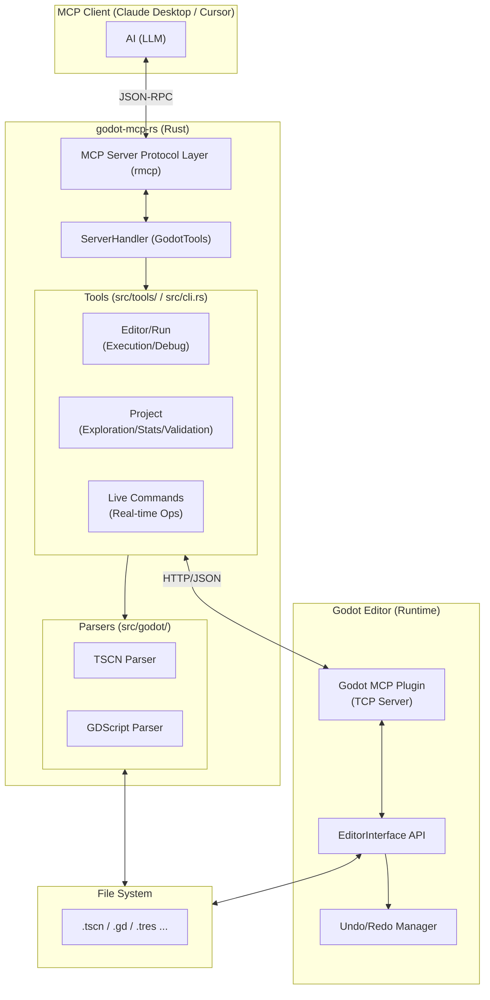

# Godot MCP Server Architecture

## Overview

Godot MCP Server is an MCP server that allows LLMs (Claude, Cursor, etc.) to manipulate and analyze Godot projects at a high level.
By integrating file-based static analysis with real-time operations via a **Godot Editor Plugin**, it enables "Live Development" where the AI develops in synchronization with the editor.

## System Configuration

## Tool Categories (58 tools total)

| Category             | Tools | Key Features                                               |
| :------------------- | :---: | :--------------------------------------------------------- |
| **Live (Real-time)** |  24   | Editor operations (add, remove, group, anim, signal, etc.) |
| **Editor/Run**       |   6   | Run project, stop, get logs, check version                 |
| **Project**          |   7   | File exploration, search, stats, validation, node info     |
| **Scene**            |  13   | File-based create, read, edit, compare, templates          |
| **Script**           |   6   | File-based create, parse, add function/variable            |
| **Resource**         |   2   | Resource list, parsing                                     |

## Major Components

### 1. Real-time Layer (`live-*` commands)

Sends HTTP/JSON requests from the Rust CLI to the plugin inside the Godot Editor.

- **Undo/Redo Integration**: By using `EditorUndoRedoManager`, changes made by the AI are handled just like human operations.
- **Synchronous Execution**: Since it's processed in-memory, changes are reflected immediately without waiting for files to be saved.

### 2. Static Analysis Layer (`src/godot/`)

Parses Godot's custom serialization formats (TSCN/TRES) in Rust.

- Allows for large-scale refactoring and scene structure analysis even when the editor is not running.

### 3. Process Control Layer

Uses `.godot_mcp_pid` and `.godot_mcp_output` files to persist Godot execution process survival checks and log outputs across stateless MCP connections.
