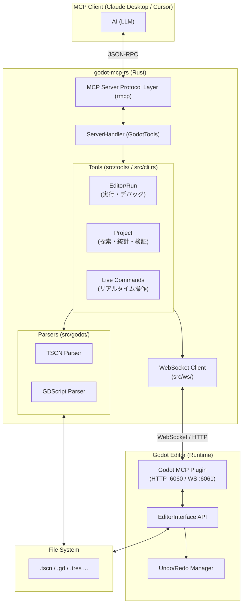

# Godot MCP Server アーキテクチャ

## 概要

LLM（Claude, Cursor 等）が Godot プロジェクトを高度に操作・分析するための MCP サーバーです。
ファイルベースの静的解析に加え、**Godot エディタープラグイン**を介したリアルタイム操作を統合することで、AI がエディターと同期しながら開発を進める「ライブ・デベロップメント」を実現します。

## システム構成

## ツール分類 (全 58 種)

| カテゴリ                | ツール数 | 主な機能                                                |
| :---------------------- | :------: | :------------------------------------------------------ |
| **Live (リアルタイム)** |    24    | エディター操作 (add, remove, group, anim, signal, etc.) |
| **Editor/Run**          |    6     | プロジェクト実行、停止、ログ取得、バージョン確認        |
| **Project**             |    7     | ファイル探索、検索、統計、検証、ノード型情報            |
| **Scene**               |    13    | ファイルベースの作成、読取、編集、比較、テンプレート    |
| **Script**              |    6     | ファイルベースの作成、解析、関数/変数追加               |
| **Resource**            |    2     | リソース一覧、パース                                    |

## 主要コンポーネント

### 1. リアルタイム・レイヤー (`live-*` コマンド)

Rust から Godot エディター内のプラグインに対して **WebSocket** (ポート 6061) または **HTTP** (ポート 6060、フォールバック) でリクエストを送信します。

- **WebSocket 優先**: 低遅延・双方向通信。接続失敗時は HTTP にフォールバック。
- **Undo/Redo 統合**: `EditorUndoRedoManager` を使用することで、AI による変更を人間の操作と同様に扱えます。
- **同期実行**: インメモリーで処理されるため、ファイルの保存を待たずに即座に変更が反映されます。

### 2. 静的解析・レイヤー (`src/godot/`)

Godot のカスタムシリアライズ形式（TSCN/TRES）を Rust でパースします。

- エディターを起動していない状態でも、大規模なリファクタリングやシーン構造の分析が可能です。

### 3. プロセス制御レイヤー

`.godot_mcp_pid` や `.godot_mcp_output` ファイルを使用して、ステートレスな MCP 接続間で Godot 実行プロセスの生存確認やログ出力を永続化します。
