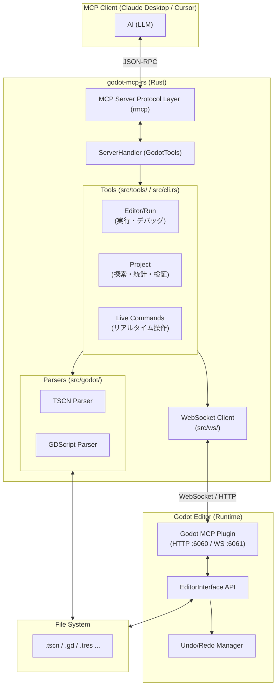

# Godot MCP Server アーキテクチャ

## 概要

LLM（Claude, Cursor 等）が Godot プロジェクトを高度に操作・分析するための MCP サーバーです。
ファイルベースの静的解析に加え、**Godot エディタープラグイン**を介したリアルタイム操作を統合することで、AI がエディターと同期しながら開発を進める「ライブ・デベロップメント」を実現します。

## システム構成

## ツール分類

### MCP 公開ツール（MCP サーバー経由で利用可能）

MCP プロトコル経由で AI（Claude Desktop / Cursor 等）から直接呼び出せるツールは、以下の **3 本**のみです。

| ツール名           | 説明                                                                         |
| :----------------- | :--------------------------------------------------------------------------- |
| `godot_query`      | GraphQL クエリを実行（プロジェクト情報、シーン、スクリプトの読み取り）       |
| `godot_mutate`     | GraphQL ミューテーションを実行（ノード追加、プロパティ変更、ファイル作成等） |
| `godot_introspect` | GraphQL スキーマ（SDL またはイントロスペクション形式）を取得                 |

> **注意**: これらのツールは GraphQL インターフェースを提供しており、実際の操作（ノード追加、シーン作成等）は GraphQL スキーマ内のミューテーションとして定義されています。利用可能な操作の一覧は `godot_introspect` で取得できます。

### CLI/レガシーツール（内部実装、CLI 経由でのみ利用可能）

以下のツール群は実装されていますが、**MCP サーバーとしては公開されていません**。CLI モード（`godot-mcp-rs tool <command>`）でのみ利用可能です。

| カテゴリ                | ツール数 | 主な機能                                                |
| :---------------------- | :------: | :------------------------------------------------------ |
| **Live (リアルタイム)** |    24    | エディター操作 (add, remove, group, anim, signal, etc.) |
| **Editor/Run**          |    6     | プロジェクト実行、停止、ログ取得、バージョン確認        |
| **Project**             |    7     | ファイル探索、検索、統計、検証、ノード型情報            |
| **Scene**               |    13    | ファイルベースの作成、読取、編集、比較、テンプレート    |
| **Script**              |    6     | ファイルベースの作成、解析、関数/変数追加               |
| **Resource**            |    2     | リソース一覧、パース                                    |
| **合計**                |  **58**  |                                                         |

> **注意**: これらのレガシーツールの機能は、GraphQL ミューテーション（`godot_mutate`）経由で同等の操作が可能です。MCP 経由での利用を推奨します。

## 主要コンポーネント

### 1. リアルタイム・レイヤー (`live-*` コマンド)

Rust から Godot エディター内のプラグインに対して **WebSocket** (ポート 6061) または **HTTP** (ポート 6060、フォールバック) でリクエストを送信します。

- **WebSocket 優先**: 低遅延・双方向通信。接続失敗時は HTTP にフォールバック。
- **Undo/Redo 統合**: `EditorUndoRedoManager` を使用することで、AI による変更を人間の操作と同様に扱えます。
- **同期実行**: インメモリーで処理されるため、ファイルの保存を待たずに即座に変更が反映されます。

### 2. 静的解析・レイヤー (`src/godot/`)

Godot のカスタムシリアライズ形式（TSCN/TRES）を Rust でパースします。

- エディターを起動していない状態でも、大規模なリファクタリングやシーン構造の分析が可能です。

### 3. パスユーティリティ (`src/path_utils.rs`)

`res://` パスとファイルシステムパスの変換を共通化し、パストラバーサル対策を提供します。

- **ResPath 型**: 安全なリソースパス表現（`..` 検出、絶対パス拒否）
- **to_fs_path()**: `res://` → ファイルシステムパス（検証付き）
- **to_res_path()**: ファイルシステムパス → `res://`
- **validate_within_project()**: `canonicalize()` によるプロジェクト外アクセス防止

### 4. プロセス制御レイヤー

`.godot_mcp_pid` や `.godot_mcp_output` ファイルを使用して、ステートレスな MCP 接続間で Godot 実行プロセスの生存確認やログ出力を永続化します。
