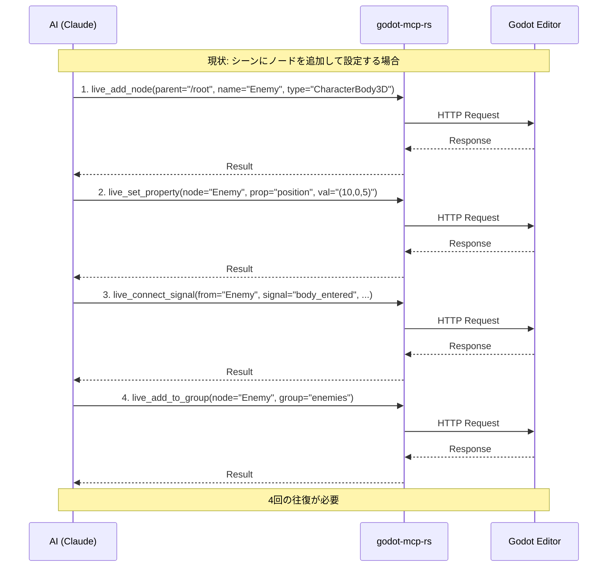
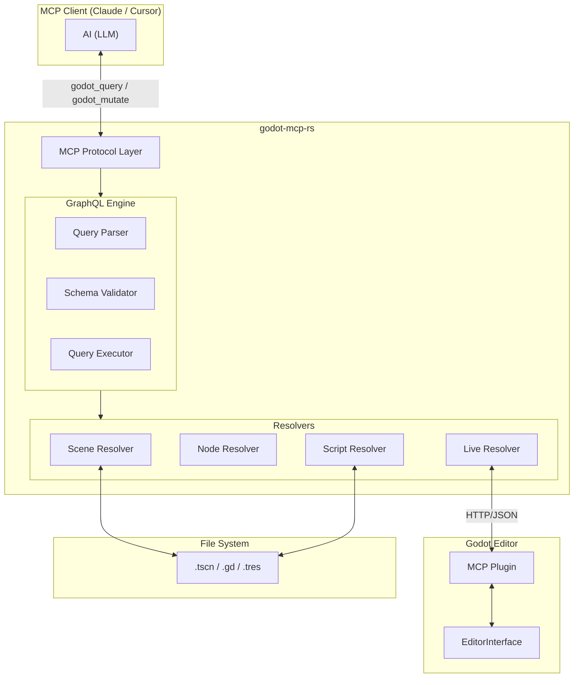
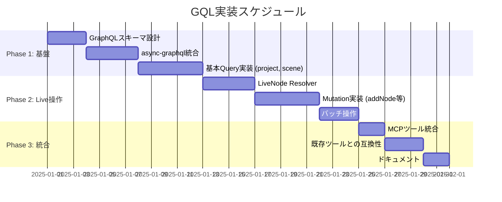
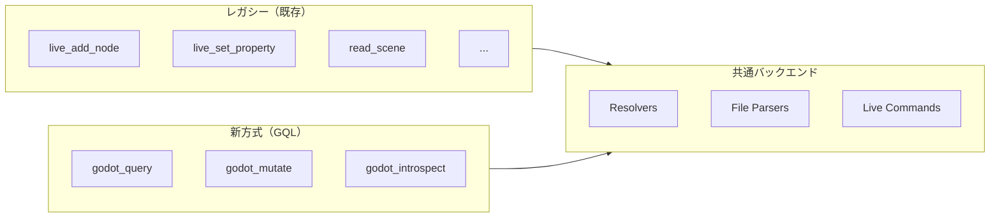
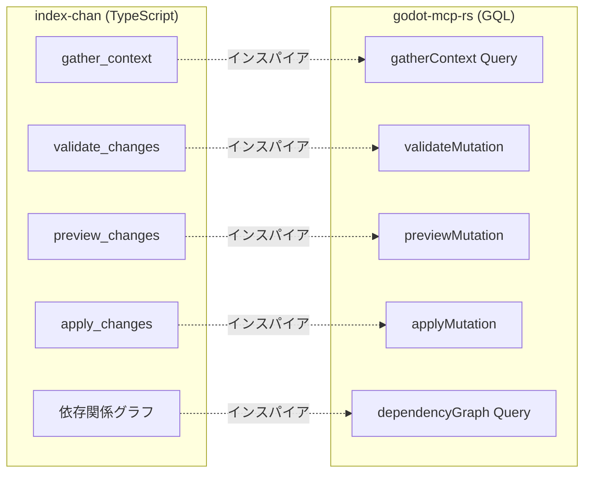
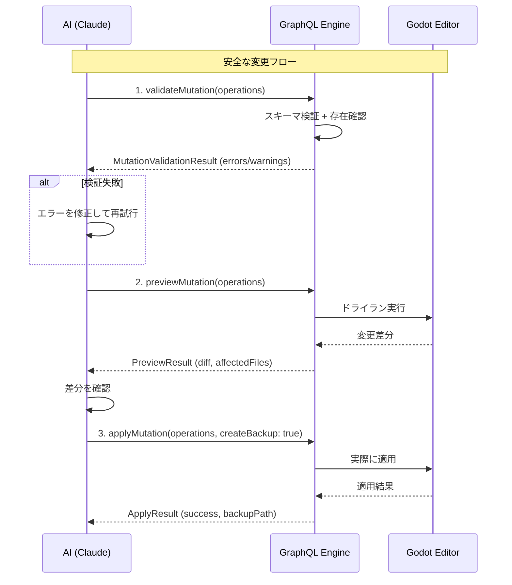
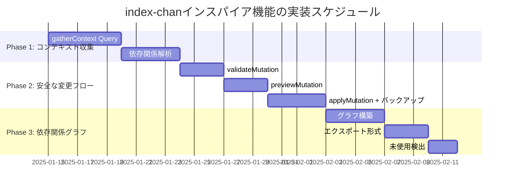

# Godot Query Language (GQL) 設計書

## 概要

本設計書は、GraphQL の思想を godot-mcp-rs に取り入れ、AI エージェントの効率を大幅に向上させるための **設計（契約）** を記述します。実装の詳細は `docs/IMPLEMENTATION_GQL.md`、実装計画は `docs/PLAN_GQL.md` を参照してください。

---

## 関連ドキュメント（役割分担）

- **エージェント入口（読む順・ルール）**: `CLAUDE.md`
- **契約（設計・Why/What）**: `docs/DESIGN_GQL.md`（本書）
- **スキーマ（SDL 単一ソース）**: `docs/gql/schema.graphql`
- **実装ノート（How）**: `docs/IMPLEMENTATION_GQL.md`
- **実装計画（When/Order/DoD）**: `docs/PLAN_GQL.md`

> NOTE: 以降、本書にあるスキーマ断片は説明用です。正確な契約は `docs/gql/schema.graphql` を参照してください。

### 背景: なぜ GraphQL 思想が必要か

[GraphQL の力で AI Agent を最大 47% 速くする](https://zenn.dev/mixi/articles/graphql-as-agent-tool) の記事によると、GraphQL を AI エージェントのツールとして使用することで以下の利点があります：

1. **スキーマ = ツール定義**: AI が「何ができるか」を自己理解
2. **インスペクション**: 未知の API でも自己探索可能
3. **1 エンドポイント**: 往復回数削減による高速化
4. **型バリデーション**: LLM のミスを早期検出

---

## 現状の問題点



### 問題点まとめ

| 問題                         | 詳細                                               |
| :--------------------------- | :------------------------------------------------- |
| **往復回数が多い**           | 1 つの論理的操作に複数のツールコールが必要         |
| **ツール定義が膨大**         | 56 個のツール定義がコンテキストを圧迫              |
| **関連データ取得が非効率**   | ノード情報+子ノード+プロパティを取るのに複数コール |
| **エラーハンドリングが分散** | 各ツールコールごとにエラー処理                     |

---

## 提案するアーキテクチャ



---

## GraphQL スキーマ定義

> **単一ソース**: `docs/gql/schema.graphql`  
> 本章は「何ができるか」の説明用。スキーマの厳密な差分管理は SDL 側で行います。

### Query（読み取り操作）

```graphql
type Query {
  """
  プロジェクト全体の情報を取得
  """
  project: Project!

  """
  シーンファイルの内容を取得
  """
  scene(path: String!): Scene

  """
  スクリプトファイルの内容を取得
  """
  script(path: String!): Script

  """
  エディター上の現在のシーンを取得（live操作）
  """
  currentScene: LiveScene

  """
  ノードの詳細情報を取得（live操作）
  """
  node(path: String!): LiveNode

  """
  Godotノード型の情報を取得
  """
  nodeTypeInfo(typeName: String!): NodeTypeInfo

  # ========== Debugging (Phase 2) ==========

  """
  デバッガーのエラー情報を取得
  """
  debuggerErrors: [DebuggerError!]!

  """
  エディターのログを取得
  """
  logs(limit: Int): [LogEntry!]!

  """
  オブジェクトIDからGodotオブジェクトの詳細を取得
  """
  objectById(objectId: String!): GodotObject
}

type Project {
  """
  プロジェクト名
  """
  name: String!

  """
  プロジェクトパス
  """
  path: String!

  """
  全シーン一覧
  """
  scenes: [SceneFile!]!

  """
  全スクリプト一覧
  """
  scripts: [ScriptFile!]!

  """
  統計情報
  """
  stats: ProjectStats!

  """
  検証結果
  """
  validation: ProjectValidationResult!
}

type Scene {
  """
  シーンファイルパス
  """
  path: String!

  """
  ルートノード
  """
  root: SceneNode!

  """
  全ノードをフラットに取得
  """
  allNodes: [SceneNode!]!

  """
  外部リソース一覧
  """
  externalResources: [ExternalResource!]!
}

type SceneNode {
  """
  ノード名
  """
  name: String!

  """
  ノードタイプ (CharacterBody3D, Sprite2D, etc.)
  """
  type: String!

  """
  ノードパス
  """
  path: String!

  """
  プロパティ一覧
  """
  properties: [Property!]!

  """
  特定のプロパティを取得
  """
  property(name: String!): Property

  """
  子ノード
  """
  children: [SceneNode!]!

  """
  アタッチされたスクリプト
  """
  script: Script

  """
  所属グループ
  """
  groups: [String!]!

  """
  接続されたシグナル
  """
  signals: [SignalConnection!]!
}

type LiveScene {
  """
  現在開いているシーンのパス
  """
  path: String

  """
  ルートノード
  """
  root: LiveNode!

  """
  選択中のノード
  """
  selectedNodes: [LiveNode!]!
}

type LiveNode {
  """
  ノード名
  """
  name: String!

  """
  ノードタイプ
  """
  type: String!

  """
  ノードパス
  """
  path: String!

  """
  グローバル座標（3D）
  """
  globalPosition: Vector3

  """
  グローバル座標（2D）
  """
  globalPosition2D: Vector2

  """
  全プロパティ
  """
  properties: [Property!]!

  """
  子ノード
  """
  children: [LiveNode!]!

  """
  利用可能なシグナル
  """
  availableSignals: [SignalInfo!]!

  """
  接続済みシグナル
  """
  connectedSignals: [SignalConnection!]!
}

type Script {
  """
  スクリプトパス
  """
  path: String!

  """
  継承元クラス
  """
  extends: String!

  """
  クラス名（class_name）
  """
  className: String

  """
  関数一覧
  """
  functions: [Function!]!

  """
  変数一覧
  """
  variables: [Variable!]!

  """
  シグナル定義
  """
  signals: [SignalDefinition!]!

  """
  @export変数
  """
  exports: [Variable!]!
}
```

### Mutation（書き込み操作）

```graphql
type Mutation {
  # ========== ファイルベース操作 ==========

  """
  新しいシーンを作成
  """
  createScene(input: CreateSceneInput!): SceneResult!

  """
  テンプレートからシーン作成
  """
  createSceneFromTemplate(input: TemplateSceneInput!): SceneResult!

  """
  スクリプトを作成
  """
  createScript(input: CreateScriptInput!): ScriptResult!

  # ========== ライブ操作（エディター連携） ==========

  """
  ノードを追加（Undo対応）
  """
  addNode(input: AddNodeInput!): NodeResult!

  """
  ノードを削除（Undo対応）
  """
  removeNode(path: String!): OperationResult!

  """
  ノードを複製（Undo対応）
  """
  duplicateNode(path: String!): NodeResult!

  """
  ノードを移動（Undo対応）
  """
  reparentNode(path: String!, newParent: String!): NodeResult!

  """
  プロパティを設定（Undo対応）
  """
  setProperty(input: SetPropertyInput!): OperationResult!

  """
  複数プロパティを一括設定（Undo対応）
  """
  setProperties(
    nodePath: String!
    properties: [PropertyInput!]!
  ): OperationResult!

  """
  シグナルを接続（Undo対応）
  """
  connectSignal(input: ConnectSignalInput!): OperationResult!

  """
  シグナルを切断（Undo対応）
  """
  disconnectSignal(input: DisconnectSignalInput!): OperationResult!

  """
  グループに追加
  """
  addToGroup(nodePath: String!, group: String!): OperationResult!

  """
  グループから削除
  """
  removeFromGroup(nodePath: String!, group: String!): OperationResult!

  """
  シーンを保存
  """
  saveScene: OperationResult!

  """
  シーンを開く
  """
  openScene(path: String!): OperationResult!

  # ========== 開発・テスト支援 ==========

  """
  GdUnit4テストを実行し、構造化された結果を返却
  """
  runTests(input: RunTestsInput!): TestExecutionResult!

  # ========== Debugging Operations (Phase 2) ==========

  """
  実行を一時停止
  """
  pause: OperationResult!

  """
  実行を再開
  """
  resume: OperationResult!

  """
  次の行までステップ実行
  """
  step: OperationResult!

  """
  ブレークポイントを設定
  """
  setBreakpoint(input: BreakpointInput!): OperationResult!

  """
  ブレークポイントを削除
  """
  removeBreakpoint(input: BreakpointInput!): OperationResult!

  # ========== バッチ操作 ==========

  """
  複数操作を一括実行（トランザクション的）
  """
  batch(operations: [BatchOperation!]!): BatchResult!
}

input AddNodeInput {
  """
  親ノードのパス
  """
  parent: String!

  """
  新しいノード名
  """
  name: String!

  """
  ノードタイプ
  """
  type: String!

  """
  初期プロパティ（オプション）
  """
  properties: [PropertyInput!]

  """
  追加するグループ（オプション）
  """
  groups: [String!]
}

input SetPropertyInput {
  """
  ノードパス
  """
  nodePath: String!

  """
  プロパティ名
  """
  property: String!

  """
  値（GDScript形式の文字列）
  """
  value: String!
}

input PropertyInput {
  name: String!
  value: String!
}

input ConnectSignalInput {
  """
  シグナル発信元ノード
  """
  fromNode: String!

  """
  シグナル名
  """
  signal: String!

  """
  接続先ノード
  """
  toNode: String!

  """
  呼び出すメソッド名
  """
  method: String!
}

input BatchOperation {
  """
  操作タイプ
  """
  type: BatchOperationType!

  """
  操作の引数（JSON）
  """
  args: JSON!
}

enum BatchOperationType {
  ADD_NODE
  REMOVE_NODE
  SET_PROPERTY
  CONNECT_SIGNAL
  ADD_TO_GROUP
}
```

---

## 具体的なユースケース

### ユースケース 1: プレイヤーシーンの構造確認

**現状（複数ツールコール）:**

```
1. read_scene(path="res://player.tscn")
2. get_node_tree(path="res://player.tscn")
3. analyze_script(path="res://player.gd")
```

**GQL（1 回のクエリ）:**

```graphql
query PlayerSceneAnalysis {
  scene(path: "res://player.tscn") {
    root {
      name
      type
      properties {
        name
        value
      }
      children {
        name
        type
        children {
          name
          type
        }
      }
      script {
        path
        extends
        functions {
          name
          arguments
        }
        exports {
          name
          type
          defaultValue
        }
      }
    }
  }
}
```

**レスポンス例:**

```json
{
  "data": {
    "scene": {
      "root": {
        "name": "Player",
        "type": "CharacterBody3D",
        "properties": [{ "name": "position", "value": "Vector3(0, 1, 0)" }],
        "children": [
          {
            "name": "CollisionShape3D",
            "type": "CollisionShape3D",
            "children": []
          },
          {
            "name": "MeshInstance3D",
            "type": "MeshInstance3D",
            "children": []
          },
          {
            "name": "Camera3D",
            "type": "Camera3D",
            "children": []
          }
        ],
        "script": {
          "path": "res://player.gd",
          "extends": "CharacterBody3D",
          "functions": [
            { "name": "_ready", "arguments": [] },
            { "name": "_physics_process", "arguments": ["delta"] },
            { "name": "jump", "arguments": [] }
          ],
          "exports": [
            { "name": "speed", "type": "float", "defaultValue": "5.0" },
            { "name": "jump_force", "type": "float", "defaultValue": "10.0" }
          ]
        }
      }
    }
  }
}
```

---

### ユースケース 2: 敵キャラクターの追加と設定

**現状（4 回のツールコール）:**

```
1. live_add_node(parent="/root/Main", name="Enemy", type="CharacterBody3D")
2. live_set_property(node="/root/Main/Enemy", property="position", value="Vector3(10, 0, 5)")
3. live_connect_signal(from="/root/Main/Enemy", signal="body_entered", to="/root/Main/Player", method="_on_enemy_contact")
4. live_add_to_group(node="/root/Main/Enemy", group="enemies")
```

**GQL（1 回の Mutation）:**

```graphql
mutation CreateEnemy {
  addNode(
    input: {
      parent: "/root/Main"
      name: "Enemy"
      type: "CharacterBody3D"
      properties: [{ name: "position", value: "Vector3(10, 0, 5)" }]
      groups: ["enemies"]
    }
  ) {
    success
    node {
      path
      type
    }
  }

  connectSignal(
    input: {
      fromNode: "/root/Main/Enemy"
      signal: "body_entered"
      toNode: "/root/Main/Player"
      method: "_on_enemy_contact"
    }
  ) {
    success
  }
}
```

**レスポンス:**

```json
{
  "data": {
    "addNode": {
      "success": true,
      "node": {
        "path": "/root/Main/Enemy",
        "type": "CharacterBody3D"
      }
    },
    "connectSignal": {
      "success": true
    }
  }
}
```

---

### ユースケース 3: プロジェクト全体の問題検出

**GQL:**

```graphql
query ProjectHealthCheck {
  project {
    name
    stats {
      sceneCount
      scriptCount
      resourceCount
    }
    validation {
      isValid
      errors {
        file
        line
        message
        severity
      }
      warnings {
        file
        message
      }
    }
    scenes {
      path
      # 各シーンのルートノード型を確認
    }
  }
}
```

---

### ユースケース 4: インスペクション（スキーマ自己探索）

AI が「何ができるか」を自分で調べる：

```graphql
query Introspection {
  __schema {
    queryType {
      fields {
        name
        description
        args {
          name
          type {
            name
          }
        }
      }
    }
    mutationType {
      fields {
        name
        description
        args {
          name
          type {
            name
          }
        }
      }
    }
  }
}
```

これにより、AI は**ツール定義を事前に持たなくても**、実行時にスキーマを問い合わせて「何ができるか」を理解できます。

---

## MCP ツール定義（最小化）

```rust
// 既存: 56個のツール定義
// 提案: 3個のツール定義

#[derive(Serialize, Deserialize, JsonSchema)]
pub struct GodotQueryRequest {
    /// GraphQL query string
    pub query: String,
    /// Optional variables
    pub variables: Option<serde_json::Value>,
}

#[derive(Serialize, Deserialize, JsonSchema)]
pub struct GodotMutateRequest {
    /// GraphQL mutation string
    pub mutation: String,
    /// Optional variables
    pub variables: Option<serde_json::Value>,
}

#[derive(Serialize, Deserialize, JsonSchema)]
pub struct GodotIntrospectRequest {
    /// Introspection depth (default: 2)
    pub depth: Option<u32>,
}

// MCPツールとして登録
impl ServerHandler for GodotTools {
    fn list_tools(&self) -> ListToolsResult {
        vec![
            Tool {
                name: "godot_query",
                description: "Execute a GraphQL query against the Godot project. \
                              Use introspection to discover available fields.",
                input_schema: schema_for!(GodotQueryRequest),
            },
            Tool {
                name: "godot_mutate",
                description: "Execute a GraphQL mutation to modify the Godot project. \
                              All mutations support Undo/Redo.",
                input_schema: schema_for!(GodotMutateRequest),
            },
            Tool {
                name: "godot_introspect",
                description: "Get the GraphQL schema to understand available operations.",
                input_schema: schema_for!(GodotIntrospectRequest),
            },
        ]
    }
}
```

---

## 実装計画



### Phase 1: 基盤構築（約 2 週間）

1. **Cargo.toml に依存追加**

   ```toml
   [dependencies]
   async-graphql = "7"
   ```

2. **スキーマ定義**

   - `src/graphql/schema.rs` - Query/Mutation 定義
   - `src/graphql/types.rs` - 型定義

3. **基本 Resolver 実装**
   - `project` - 既存の`get_project_stats`を流用
   - `scene` - 既存の`read_scene`を流用

### Phase 2: Live 操作（約 2 週間）

1. **LiveNode Resolver**

   - Godot プラグインとの通信を Resolver 化
   - 既存の`live_*`コマンドをラップ

2. **Mutation 実装**
   - `addNode`, `removeNode`, `setProperty`等
   - バッチ操作のトランザクション的実行

### Phase 3: 統合（約 1 週間）

1. **MCP ツール統合**
   - `godot_query`, `godot_mutate`, `godot_introspect`
2. **後方互換性**
   - 既存の 56 ツールは維持（非推奨化）
   - 段階的に移行

---

## 期待される効果

| 指標                     | 現状                | GQL 導入後            |
| :----------------------- | :------------------ | :-------------------- |
| MCP ツール数             | 56                  | **3**                 |
| 平均往復回数/操作        | 2-4 回              | **1 回**              |
| コンテキストトークン消費 | 高                  | **低**                |
| 新機能追加時の変更       | MCP ツール定義+実装 | **Resolver 追加のみ** |
| エラー検出タイミング     | 実行時              | **クエリ解析時**      |

---

## 補足: 既存ツールとの共存

移行期間中は、両方のアプローチを並行して提供できます：



AI は状況に応じて使い分けられます：

- **単純な操作**: レガシーツールでも可
- **複雑な操作**: GQL でバッチ実行
- **未知の API**: インスペクションで探索

---

## 結論

GraphQL 思想の導入により、godot-mcp-rs は：

1. **より効率的に**: 往復回数削減、トークン節約
2. **より堅牢に**: 型バリデーション、エラー早期検出
3. **より拡張しやすく**: Resolver 追加だけで新機能
4. **より自己説明的に**: インスペクションで AI が自己学習

これにより、「最強の Godot MCP」への大きな一歩となります。

---

## 拡張機能: index-chan インスパイア

> 参考: [index-chan](https://github.com/MERY-Sheep/index_chan) - LLM エージェント向けコード分析・変更ツール

index-chan の設計思想から、以下の機能を GQL に組み込みます。

### コンセプト比較



---

### 1. コンテキスト収集 (gatherContext)

シーンやスクリプトに関連する全ての情報を 1 クエリで取得。AI が「この機能を修正するために必要な情報」を効率的に収集できます。

#### スキーマ追加

```graphql
type Query {
  # ... 既存のクエリ ...

  """
  エントリーポイントから関連する全ての情報を収集
  AIが修正に必要なコンテキストを一括取得するために使用
  """
  gatherContext(input: GatherContextInput!): GatheredContext!
}

input GatherContextInput {
  """
  エントリーポイント（シーンまたはスクリプトのパス）
  """
  entryPoint: String!

  """
  依存関係の探索深度（デフォルト: 2）
  """
  depth: Int

  """
  含めるファイルタイプ
  """
  include: [FileType!]
}

enum FileType {
  SCENE
  SCRIPT
  RESOURCE
  SHADER
}

type GatheredContext {
  """
  エントリーポイント
  """
  entryPoint: String!

  """
  メインのシーン/スクリプト
  """
  main: ContextItem!

  """
  このファイルが依存しているファイル
  """
  dependencies: [ContextItem!]!

  """
  このファイルに依存しているファイル
  """
  dependents: [ContextItem!]!

  """
  関連するリソース
  """
  resources: [ResourceInfo!]!

  """
  統計サマリー
  """
  summary: ContextSummary!
}

type ContextItem {
  """
  ファイルパス
  """
  path: String!

  """
  ファイルタイプ
  """
  type: FileType!

  """
  シーンの場合のノード構造
  """
  scene: Scene

  """
  スクリプトの場合の解析結果
  """
  script: Script

  """
  依存関係
  """
  dependsOn: [String!]!

  """
  被依存関係
  """
  usedBy: [String!]!
}

type ContextSummary {
  """
  収集したファイル数
  """
  totalFiles: Int!

  """
  シーン数
  """
  sceneCount: Int!

  """
  スクリプト数
  """
  scriptCount: Int!

  """
  リソース数
  """
  resourceCount: Int!

  """
  総ノード数
  """
  totalNodes: Int!

  """
  総関数数
  """
  totalFunctions: Int!
}
```

#### ユースケース: プレイヤー機能の修正

```graphql
query GatherPlayerContext {
  gatherContext(
    input: {
      entryPoint: "res://scenes/player.tscn"
      depth: 2
      include: [SCENE, SCRIPT]
    }
  ) {
    main {
      path
      scene {
        root {
          name
          type
          children {
            name
            type
          }
        }
      }
      script {
        functions {
          name
          arguments
        }
        exports {
          name
          type
        }
      }
    }

    dependencies {
      path
      type
      # プレイヤーが依存する他のシーン（武器、エフェクトなど）
    }

    dependents {
      path
      # プレイヤーを使用しているシーン（メインシーン、レベルなど）
    }

    summary {
      totalFiles
      totalFunctions
    }
  }
}
```

**レスポンス例:**

```json
{
  "data": {
    "gatherContext": {
      "main": {
        "path": "res://scenes/player.tscn",
        "scene": {
          "root": {
            "name": "Player",
            "type": "CharacterBody3D",
            "children": [
              { "name": "CollisionShape3D", "type": "CollisionShape3D" },
              { "name": "WeaponMount", "type": "Node3D" }
            ]
          }
        },
        "script": {
          "functions": [
            { "name": "_ready", "arguments": [] },
            { "name": "_physics_process", "arguments": ["delta"] },
            { "name": "take_damage", "arguments": ["amount"] }
          ],
          "exports": [
            { "name": "max_health", "type": "int" },
            { "name": "speed", "type": "float" }
          ]
        }
      },
      "dependencies": [
        { "path": "res://scenes/weapon.tscn", "type": "SCENE" },
        { "path": "res://scripts/health_component.gd", "type": "SCRIPT" }
      ],
      "dependents": [
        { "path": "res://scenes/main.tscn", "type": "SCENE" },
        { "path": "res://scenes/levels/level_01.tscn", "type": "SCENE" }
      ],
      "summary": {
        "totalFiles": 5,
        "totalFunctions": 12
      }
    }
  }
}
```

---

### 2. 安全な変更フロー (validate → preview → apply)

AI による変更を安全に適用するための 3 ステップフロー。index-chan の `validate_changes` → `preview_changes` → `apply_changes` パターンを採用。



#### スキーマ追加

```graphql
type Mutation {
  # ... 既存のミューテーション ...

  # ========== 安全な変更フロー ==========

  """
  変更を事前検証（ドライラン）
  - ノードパスの存在確認
  - プロパティ名の妥当性確認
  - 型の互換性チェック
  """
  validateMutation(input: MutationPlanInput!): MutationValidationResult!

  """
  変更のプレビュー（差分表示）
  - 変更前後の差分をテキストで表示
  - 影響を受けるファイル一覧
  """
  previewMutation(input: MutationPlanInput!): PreviewResult!

  """
  検証済みの変更を適用
  - オプションでバックアップ作成
  - Undo/Redo対応
  """
  applyMutation(input: ApplyMutationInput!): ApplyResult!
}

input MutationPlanInput {
  """
  実行する操作のリスト
  """
  operations: [PlannedOperation!]!
}

input PlannedOperation {
  """
  操作タイプ
  """
  type: OperationType!

  """
  操作の引数（JSON）
  """
  args: JSON!
}

enum OperationType {
  ADD_NODE
  REMOVE_NODE
  SET_PROPERTY
  SET_PROPERTIES
  CONNECT_SIGNAL
  DISCONNECT_SIGNAL
  ADD_TO_GROUP
  REMOVE_FROM_GROUP
  REPARENT_NODE
  DUPLICATE_NODE
  CREATE_SCRIPT
  ATTACH_SCRIPT
}

type MutationValidationResult {
  """
  全ての検証がパスしたか
  """
  isValid: Boolean!

  """
  エラー（致命的な問題）
  """
  errors: [MutationValidationError!]!

  """
  警告（非推奨や潜在的な問題）
  """
  warnings: [MutationValidationWarning!]!

  """
  検証にかかった時間（ms）
  """
  validationTimeMs: Int!
}

type MutationValidationError {
  """
  操作のインデックス
  """
  operationIndex: Int!

  """
  エラーコード
  """
  code: String!

  """
  エラーメッセージ
  """
  message: String!

  """
  修正の提案
  """
  suggestion: String
}

type MutationValidationWarning {
  """
  操作のインデックス
  """
  operationIndex: Int!

  """
  警告メッセージ
  """
  message: String!
}

type PreviewResult {
  """
  プレビューが成功したか
  """
  success: Boolean!

  """
  変更差分（unified diff形式）
  """
  diff: String!

  """
  影響を受けるファイル
  """
  affectedFiles: [AffectedFile!]!

  """
  変更の要約
  """
  summary: ChangeSummary!
}

type AffectedFile {
  """
  ファイルパス
  """
  path: String!

  """
  変更タイプ
  """
  changeType: FileChangeType!
}

enum FileChangeType {
  CREATED
  MODIFIED
  DELETED
}

type ChangeSummary {
  """
  追加されるノード数
  """
  nodesAdded: Int!

  """
  削除されるノード数
  """
  nodesRemoved: Int!

  """
  変更されるプロパティ数
  """
  propertiesChanged: Int!

  """
  接続されるシグナル数
  """
  signalsConnected: Int!
}

input ApplyMutationInput {
  """
  実行する操作
  """
  operations: [PlannedOperation!]!

  """
  バックアップを作成するか
  """
  createBackup: Boolean

  """
  バックアップの説明
  """
  backupDescription: String
}

type ApplyResult {
  """
  適用が成功したか
  """
  success: Boolean!

  """
  適用された操作数
  """
  appliedCount: Int!

  """
  バックアップパス（作成した場合）
  """
  backupPath: String

  """
  エラー（部分的に失敗した場合）
  """
  errors: [ApplyError!]!

  """
  Undo用のアクションID
  """
  undoActionId: String
}

type ApplyError {
  """
  操作のインデックス
  """
  operationIndex: Int!

  """
  エラーメッセージ
  """
  message: String!
}
```

#### ユースケース: 複数操作の安全な適用

```graphql
# Step 1: 検証
mutation ValidateEnemySetup {
  validateMutation(input: {
    operations: [
      {
        type: ADD_NODE
        args: "{\"parent\": \"/root/Main\", \"name\": \"Enemy\", \"type\": \"CharacterBody3D\"}"
      },
      {
        type: SET_PROPERTY
        args: "{\"nodePath\": \"/root/Main/Enemy\", \"property\": \"position\", \"value\": \"Vector3(10, 0, 5)\"}"
      },
      {
        type: CONNECT_SIGNAL
        args: "{\"fromNode\": \"/root/Main/Enemy\", \"signal\": \"body_entered\", \"toNode\": \"/root/Main/Player\", \"method\": \"_on_enemy_contact\"}"
      }
    ]
  }) {
    isValid
    errors {
      operationIndex
      code
      message
      suggestion
    }
    warnings {
      message
    }
  }
}

# Step 2: プレビュー
mutation PreviewEnemySetup {
  previewMutation(input: {
    operations: [
      # ... 同じ操作リスト ...
    ]
  }) {
    success
    diff
    affectedFiles {
      path
      changeType
    }
    summary {
      nodesAdded
      propertiesChanged
      signalsConnected
    }
  }
}

# Step 3: 適用
mutation ApplyEnemySetup {
  applyMutation(input: {
    operations: [
      # ... 同じ操作リスト ...
    ]
    createBackup: true
    backupDescription: "Before adding enemy character"
  }) {
    success
    appliedCount
    backupPath
    undoActionId
  }
}
```

---

### 3. 依存関係グラフ

プロジェクト全体のシーン/スクリプト間の依存関係を可視化。

#### スキーマ追加

```graphql
type Query {
  # ... 既存のクエリ ...

  """
  プロジェクトの依存関係グラフを取得
  """
  dependencyGraph(input: DependencyGraphInput): DependencyGraph!
}

input DependencyGraphInput {
  """
  フィルター: 特定のディレクトリのみ
  """
  directory: String

  """
  フィルター: ファイルタイプ
  """
  fileTypes: [FileType!]

  """
  エクスポート形式
  """
  format: GraphFormat
}

enum GraphFormat {
  """
  JSON形式（カスタム可視化用）
  """
  JSON

  """
  GraphML形式（Gephi, yEd, Cytoscape用）
  """
  GRAPHML

  """
  DOT形式（Graphviz用）
  """
  DOT

  """
  Mermaid形式（ドキュメント埋め込み用）
  """
  MERMAID
}

type DependencyGraph {
  """
  ノード（ファイル）一覧
  """
  nodes(filter: GraphNodeFilter, limit: Int, offset: Int): [GraphNode!]!

  """
  エッジ（依存関係）一覧
  """
  edges: [GraphEdge!]!

  """
  統計情報
  """
  stats: GraphStats!

  """
  エクスポートデータ（format指定時）
  """
  exportedData: String
}

input GraphNodeFilter {
  isUnused: Boolean
}

type GraphNode {
  """
  ノードID（ファイルパス）
  """
  id: String!

  """
  表示ラベル
  """
  label: String!

  """
  ファイルタイプ
  """
  type: FileType!

  """
  被依存数（このファイルを使っているファイル数）
  """
  inDegree: Int!

  """
  依存数（このファイルが使っているファイル数）
  """
  outDegree: Int!

  """
  未使用フラグ（どこからも参照されていない）
  """
  isUnused: Boolean!
}

type GraphEdge {
  """
  参照元
  """
  from: String!

  """
  参照先
  """
  to: String!

  """
  参照タイプ
  """
  referenceType: ReferenceType!
}

enum ReferenceType {
  """
  シーンのインスタンス化
  """
  INSTANTIATES

  """
  スクリプトのアタッチ
  """
  ATTACHES_SCRIPT

  """
  リソースの参照
  """
  USES_RESOURCE

  """
  preloadによる参照
  """
  PRELOADS

  """
  loadによる参照
  """
  LOADS
}

type GraphStats {
  """
  総ノード数
  """
  nodeCount: Int!

  """
  総エッジ数
  """
  edgeCount: Int!

  """
  未使用ファイル数
  """
  unusedCount: Int!

  """
  循環依存の検出
  """
  hasCycles: Boolean!

  """
  循環依存のパス（検出された場合）
  """
  cyclePaths: [[String!]!]
}
```

#### ユースケース: 未使用ファイルの検出

```graphql
query FindUnusedAssets {
  dependencyGraph(input: { fileTypes: [SCENE, SCRIPT], format: MERMAID }) {
    nodes(filter: { isUnused: true }) {
      id
      type
      label
    }

    stats {
      nodeCount
      unusedCount
      hasCycles
    }

    exportedData # Mermaid形式のグラフ
  }
}
```

**レスポンス例:**

```json
{
  "data": {
    "dependencyGraph": {
      "nodes": [
        {
          "id": "res://scenes/old_enemy.tscn",
          "type": "SCENE",
          "label": "old_enemy.tscn"
        },
        {
          "id": "res://scripts/deprecated_util.gd",
          "type": "SCRIPT",
          "label": "deprecated_util.gd"
        }
      ],
      "stats": {
        "nodeCount": 45,
        "unusedCount": 2,
        "hasCycles": false
      },
      "exportedData": "graph TD\n  main[main.tscn] --> player[player.tscn]\n  main --> enemy[enemy.tscn]\n  player --> weapon[weapon.tscn]\n  old_enemy[old_enemy.tscn]:::unused\n  classDef unused fill:#f96"
    }
  }
}
```

---

### 4. 実装優先度



---

### まとめ: index-chan からの学び

| index-chan の機能  | GQL への適用            | 効果                                                   |
| :----------------- | :---------------------- | :----------------------------------------------------- |
| `gather_context`   | `gatherContext` Query   | AI が修正に必要な情報を 1 クエリで取得                 |
| `validate_changes` | `validateMutation`      | LLM のハルシネーション（存在しないノード参照等）を防止 |
| `preview_changes`  | `previewMutation`       | 適用前に差分確認、人間のレビューが可能                 |
| `apply_changes`    | `applyMutation`         | バックアップ付きで安全に適用                           |
| 依存関係グラフ     | `dependencyGraph` Query | 未使用アセット検出、プロジェクト構造理解               |

これらの機能により、godot-mcp-rs は**より安全で、より効率的な**AI アシスト開発を実現します。
