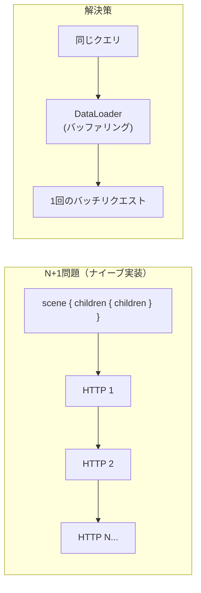

## GQL 実装ノート（How）

本ドキュメントは `docs/DESIGN_GQL.md`（設計・契約）を満たすための **実装方針（How）** をまとめます。  
スキーマの単一ソースは `docs/gql/schema.graphql` です。

### 目的

- **実装の迷いを減らす**（責務分割、境界、データフローを固定）
- **テスト駆動で進めやすくする**（モック境界を明確化）
- **設計の変更頻度を下げる**（変更しやすい内容はここに隔離）

---

## 全体構成（提案）

### Rust 側の責務分割

- **GraphQL エンジン層**
  - クエリ/ミューテーションの受け付け、スキーマ検証、実行
  - エラー整形（GraphQL errors とドメイン結果の棲み分け）
- **Resolver 層**
  - Query/Mutation を **既存の tools/parsers** に橋渡し
  - ここで「境界」を切ってテスト可能にする
- **データソース層（既存資産の流用）**
  - **静的解析**: `src/godot/`（`.tscn/.gd/.tres`）
  - **Live**: `src/tools/live.rs`（HTTP/JSON → Godot plugin）

### 依存（実装時の候補）

- GraphQL: `async-graphql`（SDL/スキーマ、実行、カスタム scalar）
- テスト補助: `insta`（ゴールデン）、`wiremock`/`httpmock`（live スタブ）
  - ※採用は `PLAN_GQL.md` の Phase 0 で決める

---

## 重要な設計論点の実装方針（抜粋）

### 1) validate / preview / apply の役割分担

- **validateMutation**
  - 「構造/存在/型互換」など **ドメイン検証** を返す（`MutationValidationResult`）
  - ここで失敗するものは apply まで行かない
- **previewMutation**
  - 差分生成（unified diff）
  - 影響ファイルの列挙（`affectedFiles`）
- **applyMutation**
  - 可能なら **バッチ全体で 1 つの undoActionId** を返す（Godot 側の Undo 粒度と整合）
  - 失敗時の扱い（部分適用の可否/rollback）は `DESIGN_GQL.md` の契約に従う

### 2) Live とファイルの整合

- Live 操作は **Editor の状態** を正とする
- ファイル Query は **ディスク** を正とする
- 混在させる API（例: preview がファイル差分を出す等）は、未保存状態の扱いを明確化する

### 3) JSON args の取り扱い

- `args: JSON!` を **単一の表現** として扱う（文字列 JSON は使わない）
- OperationType ごとに args をパースし、バリデーションエラーに **code / suggestion** を付与

---

## テストしやすい境界（TDD 前提）

### Unit テスト

- **パーサ**: `.tscn/.gd` の解析結果を固定（入力 → 出力の純関数に寄せる）
- **バリデータ**: OperationType と args(JSON) の組み合わせが期待通りの `MutationValidationResult` を返す

### Integration テスト

- **GraphQL 実行**: 代表クエリ/ミューテーションのレスポンス形状を固定
- **Live スタブ**: HTTP 境界をモックして、validate/preview/apply の往復を再現

---

## エラーポリシー（実装ガイド）

### GraphQL errors にするもの

- SDL/型レベルでの不一致（構文エラー、必須引数欠落など）

### ドメイン結果にするもの

- 存在確認、互換性、制約違反（深さ制限、パス制限、など）

---

## 外部レビューからのフィードバック（2024-12 Gemini）

以下は外部レビュー（Gemini）からの指摘事項と、それに対する実装方針です。

### A. N+1 問題と通信オーバーヘッド

**指摘**: ネストされたクエリ（例: `scene { children { children { ... } } }`）をナイーブに実装すると、ノードごとに Godot への HTTP リクエストが発生し、逆に遅くなる可能性がある。

**実装方針**:



1. **DataLoader パターンの導入**

   - `async-graphql` の `DataLoader` を活用
   - 同一リクエスト内のノード取得をバッファリングし、Godot 側へ一括リクエスト

2. **Godot 側での一括取得 API**

   - 単体取得: `get_node(path)`
   - **追加**: `get_subtree(path, depth)` — ツリー構造をまとめて JSON 化して返す
   - Resolver はこれを展開してフィールドを返す

3. **実装優先度**
   - Phase 2（Read Query）で `subtree` API を Godot プラグイン側に追加
   - DataLoader は Phase 4（Live 操作統合）で導入

---

### B. 変更の原子性 (Atomicity)

**指摘**: Mutation で `addNode` と `setProperty` を並列に書いた場合、途中でエラーが起きた場合の「部分適用」状態が問題になる。

**実装方針**:

1. **`batch` / `applyMutation` を推奨**（設計済み ✅）

   - 複数操作を 1 つのリクエストで送信
   - 「全成功 or 全失敗」を目指す

2. **Unit of Work パターン**

   - 個別の `addNode` 等も内部的には「コマンドキュー」に積む
   - リクエストの最後にまとめて Godot に commit
   - これにより、ネットワーク効率と整合性を両立

3. **エラー時の挙動（DESIGN で契約化が必要）**
   - 選択肢 A: 全ロールバック（推奨）
   - 選択肢 B: 部分適用 + エラー報告
   - → DESIGN_GQL.md の `applyMutation` セクションで契約を明確化する

---

### C. 型定義とシリアライズ

**指摘**: Godot の `Vector3` や `Color` を文字列（`"Vector3(10, 0, 5)"`）で扱うと、パースエラーの温床になる。LLM が `Vec3(10, 0, 5)` のように間違える可能性。

**現状**（schema.graphql より）:

```graphql
input PropertyInput {
  name: String!
  value: String! # ← 文字列ベース
}
```

**推奨（将来対応）**:

```graphql
# 型安全な Input Object
input Vector3Input {
  x: Float!
  y: Float!
  z: Float!
}

input ColorInput {
  r: Float!
  g: Float!
  b: Float!
  a: Float
}

# 汎用 Variant（将来拡張）
input VariantInput {
  string: String
  int: Int
  float: Float
  vector3: Vector3Input
  color: ColorInput
}
```

**実装方針**:

1. **Phase 2 では文字列ベース**を維持（既存との互換性）
2. **Phase 5 以降**で `Vector3Input` 等の型安全化を検討
3. バリデーションで「GDScript 形式の文字列パース」を強化し、典型的なミス（`Vec3` 等）を `suggestion` で修正案を提示

---

### D. gatherContext の注意点

**指摘**: プロジェクト規模によっては、`dependencies` が膨大になり、レスポンスが LLM のコンテキストウィンドウ（128k 等）を溢れさせる可能性がある。

**実装方針**:

1. **モード制御の追加**（schema への追加提案）

   ```graphql
   enum ContextMode {
     SUMMARY # シグネチャのみ（軽量）
     DETAIL # 実装の中身も含む
   }

   input GatherContextInput {
     # ... 既存 ...
     mode: ContextMode # 追加
   }
   ```

2. **トークン数概算フィールド**

   ```graphql
   type GatheredContext {
     # ... 既存 ...
     estimatedTokens: Int # 追加（概算）
   }
   ```

3. **深さ制限のデフォルト値**
   - `depth` のデフォルトは `2` を維持
   - 深すぎる探索を防ぐ

---

### E. 依存関係グラフの限界

**指摘**: `preload("...")` は静的解析で検出可能だが、動的な `load()` の解析は静的解析だけでは限界がある。

**実装方針**:

1. **Phase 5 では静的解析に限定**

   - `.tscn` の `ext_resource`
   - `.gd` の `script class_name`
   - `preload("...")` パターン

2. **動的 `load()` は「参考情報」レベル**

   - 完全性を求めない
   - ドキュメントに「静的解析の範囲」を明記

3. **将来拡張**（優先度低）
   - 実行時トレースによる動的依存検出
   - Godot プラグイン側で `load()` 呼び出しをフック

---

### F. 推奨ライブラリ構成（Rust）

| 用途           | ライブラリ                                       | 備考                                       |
| :------------- | :----------------------------------------------- | :----------------------------------------- |
| GraphQL Engine | `async-graphql`                                  | 高機能、Tokio 親和性、カスタム Scalar 対応 |
| Web Server     | `axum`（オプション）                             | MCP は stdio ベースのため、直接は不要      |
| HTTP Client    | `reqwest`                                        | Godot プラグインへのリクエスト用（既存）   |
| Godot Parser   | 自前（`src/godot/`）                             | 既存資産を流用                             |
| テスト         | `insta`（ゴールデン）、`wiremock`（HTTP モック） | Phase 0/1 で採用決定                       |

---

## 実装チェックリスト（Gemini フィードバック対応）

- [ ] **N+1 対策**: Godot プラグインに `get_subtree(path, depth)` API 追加
- [ ] **N+1 対策**: `async-graphql` の DataLoader 導入（Phase 4）
- [ ] **原子性**: `applyMutation` のエラー時挙動を DESIGN で契約化
- [ ] **型安全**: バリデーションで GDScript 形式のパースエラー時に `suggestion` を返す
- [ ] **gatherContext**: `mode` と `estimatedTokens` の追加を検討（Phase 5）
- [ ] **依存グラフ**: 静的解析の範囲をドキュメント化
